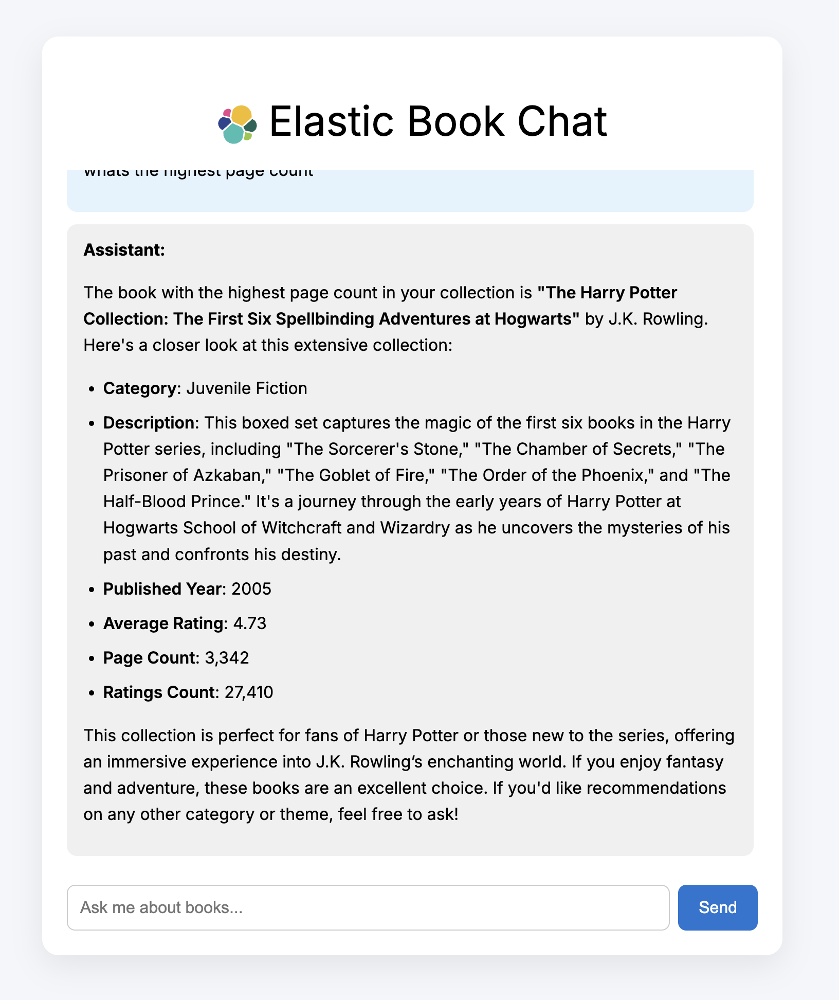

# Elastic Book Chat

The book chat app is a conversational book recommendation demo incorporating:

- Azure OpenAI (GPT-4o)
- Elastic with MCP (https://github.com/elastic/mcp-server-elasticsearch?tab=readme-ov-file)
- FastAPI backend
- Vite + React frontend

The app allows users to query a book database in natural language and receive helpful, librarian-style responses powered by real search results.

---

### Features

- Natural language search over books via Elastic MCP
- GPT-4o used for response generation and formatting
- Clear, human-readable summaries of books
- Remembers recent chat history
- Clean, responsive user interface

---

### Tech Stack

| Component    | Technology                  |
|--------------|-----------------------------|
| Frontend     | React                |
| Backend      | FastAPI (Python 3.11)       |
| Search       | Elastic MCP + Elastics |
| LLM          | Azure OpenAI (GPT-4o)       |
| Agent Engine | LangChain MCPAgent          |

---

### Getting Started

Pre-reqs: 
- Elasticsearch cluster
- Python 3.11
- Kaggle API key (optional - see below)
- Azure openAI key

### Set Up/Data Ingest

1. Clone down the repository and navigate to the mcp-demo folder:

```
git https://github.com/camillegeorgiou/mcp-demo
cd mcp-demo
```

2. Set up the Python backend:

```
python -m venv .venv
source .venv/bin/activate
pip install -r requirements.txt
```

3. Modify the .env file to include your credentials:

```
AZURE_OPENAI_API_KEY=your_azure_openai_key
ES_URL=your_elastic_url
ES_API_KEY=elastic_api
```

4. Navigate to kaggle, spin up an account and download an API key:
- Add the downloaded kaggle.json file to `.kaggle`

**Alternatiely, you can download the books.csv and modify the script to push the dataset to Elastic.

5. Run the books.py script and confirm data has made it into your cluster:

```
python books.py
```

### Backend 

6. Configure the mcp server in: `backend/elasticsearch_mcp.json` and establish the connection to your Azure endpoint:

- Modify elasticsearch_mcp to include your ES credentials. The API key should have relevant permissions. See: https://github.com/elastic/mcp-server-elasticsearch?tab=readme-ov-file
- Modify the following to reflect your Azure OpenAI deployment settings in server.py:

```
llm = AzureChatOpenAI(
        openai_api_version="2025-01-01-preview",
        azure_deployment="gpt-4o",
        azure_endpoint="https://",
```

7. Start the backend

```
uvicorn backend.server:app --reload or .venv/bin/uvicorn server:app --reload

```

- You should see the following output (or similar):
```
INFO:     Uvicorn running on http://127.0.0.1:8000 (Press CTRL+C to quit)
INFO:     Started reloader process [15448] using StatReload
INFO:     Started server process [15450]
INFO:     Waiting for application startup.
INFO:     Application startup complete.
```

### Frontend

8. In a separate terminal, set up the frontend app:

```
cd bookchat-frontend 
npm install
npm run dev
```

- Your bookchat app should be available at http://localhost:5173.

### Sample Queries
What are the best books on computing?
Which books have the highest rating?
Any good biographies for young readers?
Which book is the longest?




